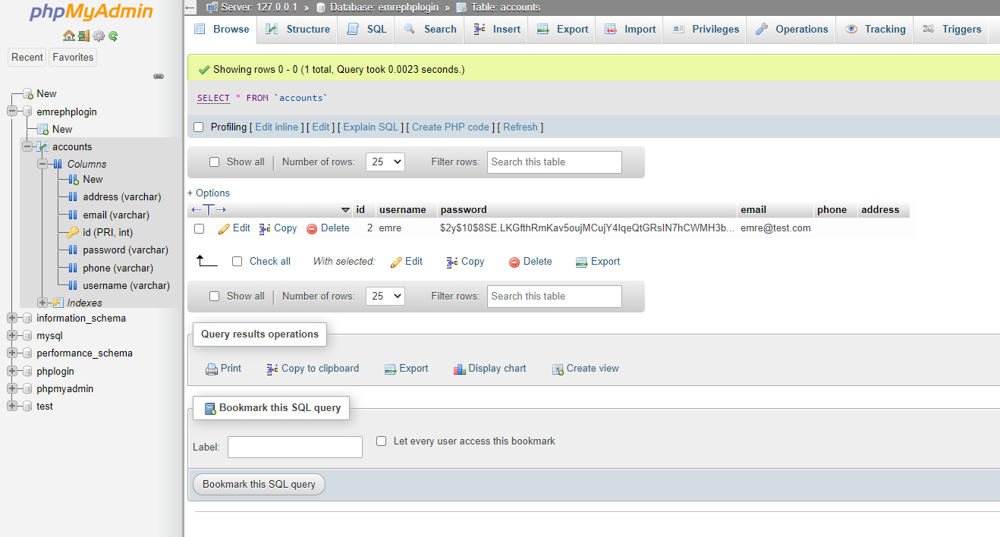

# QAUTH with PHP
- ## A authentication website written in PHP, HTML, and CSS. MySQL database is used to manage internal data.
- ## There is also an easter egg on home page. Find it :)  
# How to Setup
 ## 1. Download `emre_kilic_110510259.zip` file which includes all the necessary source files. 
 ## 2. Go to `C:\newxampp\htdocs` on your computer.
 ## 3. Create a new file in there and name it, for example, `emrephplogin`.   
   
 ## 4. Go to `emrephplogin` file you have just created.
 ## 5. Unzip the `emre_kilic_110510259.zip` here
 
 ## 6. Now you should create a database to store user data. To do that, open XAMPP.
 
 ## 7. Start Apache and MySQL modules. 
 ## 8. Click on Admin for MYSQL module and you will be navigated to the `phpMyAdmin` panel.
 
 ## 9. Create a new database and name it `emrephplogin`.
 
 ## 10. Go to `emrephplogin` and execute [this](./sql%20queries/ddl.sql) sql statement.(Note: All sql queries used for this setup can be found in `sql queries` file.)
 
 ## 11. Before moving along, you have to assure you have right configuration for your local database in the code.
 
 ## But you most likely have the same configuration like I do. Now you are able to register a user to the system.
 # How to Use
 ## 12. Go to `http://localhost/emrephplogin/register.html`.
 
 ## 13. You can also see that a new user added to our database `emrephplogin`
 
 ## 14. After registering, you will be automatically navigated to [login page](http://localhost/emrephplogin/index.html). Finally click on login button.
 
 ## 15. You will be navigated to home page that provides the list of existing users.
 
 ## Click on profile page button.(Note: System also gathers personal information such as phone number and address on profile page)
 
 ## 17. You can update your user details on profile page. After you change user details, click on update. (Note: you can also change your password, it is hashed everytime.) 
 
 ## User data also updated in our database
 
 ## 18. Navigate to home page 
 
 ## 19. You can logout the user by clicking on logout button. 
 ## 20. You can register many users as you can
  

 

